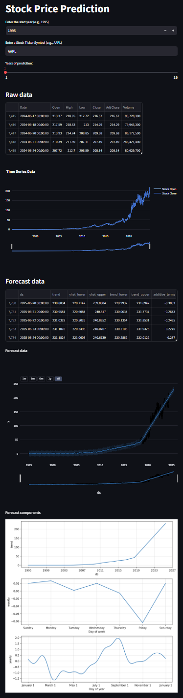

# Stock Prediction App

## Overview
This Streamlit application predicts future stock prices using historical data and the Prophet forecasting model. Users can select a stock, define the number of years for prediction, and visualize both the historical and predicted stock prices.

## Dependencies
- **Streamlit**: A Python framework designed to create interactive web applications with ease. It allows developers to build data-driven apps quickly and efficiently, using straightforward Python scripts.

- **Prophet**: A forecasting tool by Facebook that excels in handling time series data with daily observations and strong seasonal effects.

- **yFinance**: A Python library for accessing historical market data from Yahoo Finance.

- **Plotly**: A graphing library that generates interactive, publication-quality graphs online.

## Key Features
- **Dynamic Stock Selection**: Users can input a stock ticker symbol to fetch and analyze historical stock data.
- **Customizable Prediction**: Predict stock prices for 1 to 10 years into the future based on user input.
- **Data Visualization**: Interactive charts to visualize historical stock prices and forecasted trends.
- **Error Handling**: Provides informative messages for data loading errors and ensures a smooth user experience.

## How to Run
1. Install dependencies:
   ```
   pip install streamlit prophet yfinance plotly
   ```

2. Run the app:
   
   Copy code
   ```
   streamlit run main.py
   ```
4. Open the local URL provided by Streamlit in your web browser.



## Structure
- **Data Loading**: Fetches historical stock data using yfinance.
- **Modeling:** Prepares data for Prophet, fits the model, and makes predictions.
- **Visualization:** Plots raw data and forecasted prices using Plotly.

## Error Handling
- Displays error message if data loading fails.

This app leverages Streamlit for creating interactive web applications, Prophet for time series forecasting, yfinance for fetching historical stock data, and Plotly for data visualization.
